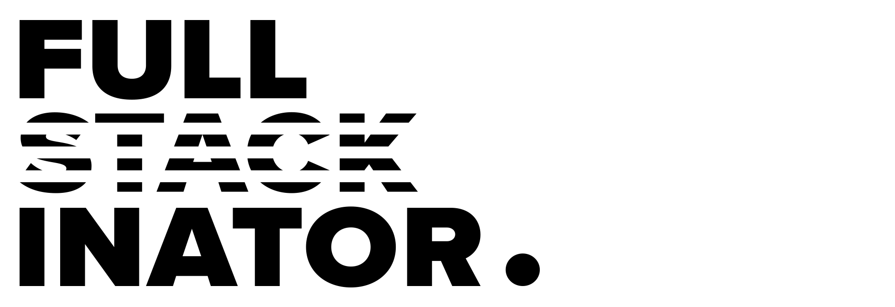

## ⚡️ Nextjs boilerplate for full stack development. ⚡️
This project is an opinionated boilerplate for a fullstack workflow using a Nodejs server with express and NextJs for the React front end. The idea is to make it a solid boilerplate for large scale SSR projects that require a custom node backend.  

### 🔎 More about this project
I could not find a solid start point for the project that incorporated Typescript / NextJs and NodeJs with Express as the backend, I also wanted to have a simplified folder structure for oganization. This boilerplate takes care of handling that start point so that you only need to consider your options for database and the API you plan to use to query data from your database. Redux is incorporated for global state managment. Typescript is setup to work in both server and client files and now works with Next.js 9.0 +  

### 🔓 Currently working with:
- [x] Nextjs
  - Custom folder structure for fullstack development organization
- [x] Redux
  - Redux-Sagas
  - Redux-Actions ( removes some pain points of redux state managment )
  - Redux Dev Tools / Chrome extension for dev build ( link at bottom )
- [x] Node Express server
  - Nodemon file watching ( live server restart for code changes )
- [x] Typescript ( Server and Client )
- [x] Styled-Components 💅  
 
## 👁‍🗨 How to use it:
### Clone the repo:
```
git clone https://github.com/slaterbbx/fullstackinator.git
```
### React + Nextjs:
https://nextjs.org/docs/  
Everything functions the same as it would while normally using Next.js to develop a react app, This project is simply a boilerplate. The Nextjs pages folder is now in the ./client folder and the server files are in ./server folder. Nodemon will watch the ./server files and recompile the server ts files upon file changes during `npm run dev` while the dev live server is running. All server production files upon `npm run build` are output to the ./distServer folder, `npm start` will start a server running your production files from the ./distServer folder.

## 💻 Commands:
### Install:
Install node_modules  
`npm install`
### Run development server:
Run the dev server with hot module reload and nodemon server auto restart<br>
`npm run dev`
### Build optimized server and client:
Build files are output to ./distServer folder  
`npm run build` ( builds all files for production / Client and Server )
### Run production server:
Runs the optimized build from the ./distServer folder  
`npm start`  

## 📚 Resources:
### Redux dev tools
https://github.com/zalmoxisus/redux-devtools-extension
### Redux Actions
https://redux-actions.js.org/

### 📝 License:
MIT License | Fullstackinator © 2019 Kyle Gallagher